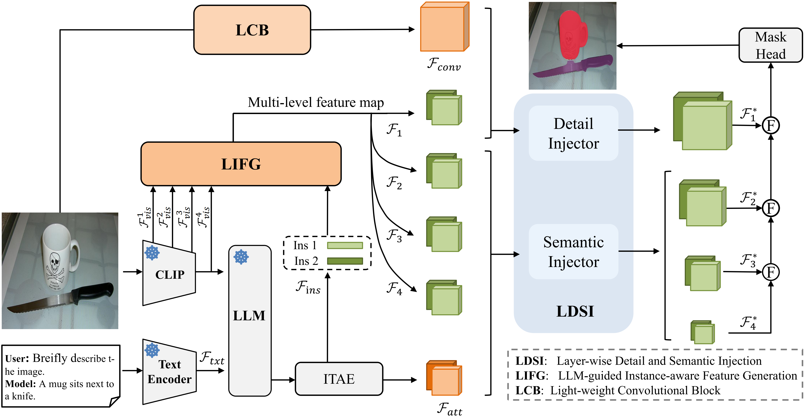
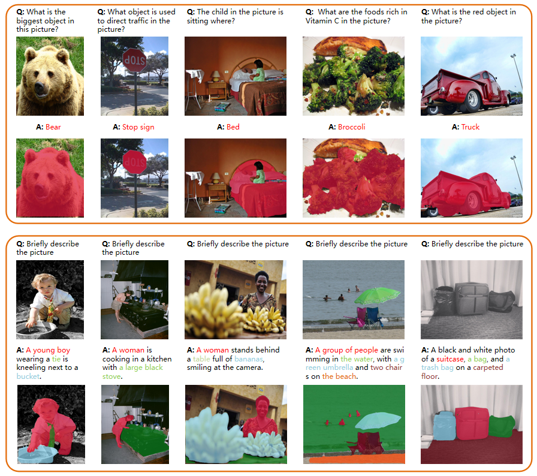

# HG-LMM: Unleashing High-Quality Pixel Grounding Capabilities in Frozen Large Multimodal Models

## Introduction

This is the official release of paper **HG-LMM: Unleashing High-Quality Pixel Grounding Capabilities in
Frozen Large Multimodal Models**. 
It is currently under construction.

> [**HG-LMM: Unleashing High-Quality Pixel Grounding Capabilities in Frozen Large Multimodal Models**](https://arxiv.org/abs/2406.05821),            
> Wenjie Li, Jiale Cao, Jin Xie, Aiping Yang, and Yanwei Pang            
> [Bibtex](https://github.com/WenjieLi2008/HG-LMM#citation)


## Dependencies

1. This project is built on [Xtuner](https://github.com/InternLM/xtuner). The segmentation modules  including training losses are  from [MMSegmentation](https://github.com/open-mmlab/mmsegmentation) and [MMDetection](https://github.com/open-mmlab/mmdetection). Please refer to the official documents of these toolkits for installation guidance.

2. The version of [transformers](https://github.com/huggingface/transformers) used in this project is v4.39.1. And using versions beyond v4.40.0 cannot reproduce the performances . 

3. Accelerate is used to build the evaluation pipeline of our models. Please refer to its official
[webpage](https://github.com/huggingface/accelerate) for installation.

## Data Preparation
**[PNG](https://github.com/BCV-Uniandes/PNG) Dataset.** Download images `train2017` and `val2017` from COCO's official [website](https://cocodataset.org/#home) and put them under `data/coco`. Download annotation files `png_coco_train2017.json` and `png_coco_val2017.json` from PNG's project [page](https://bcv-uniandes.github.io/panoptic-narrative-grounding/#downloads)  and put them under `data/coco/annotations`. Download mask annotation  `panoptic_train2017(.json)` and `panoptic_val2017(.json)` from COCO's official [website](http://images.cocodataset.org/annotations/panoptic_annotations_trainval2017.zip) and put them under `data/coco/annotations`.

**[RefCOCO Series](https://github.com/lichengunc/refer).** Please refer to MMDetection's [tutorial](https://mmdetection.readthedocs.io/en/latest/user_guides/dataset_prepare.html#refcoco-dataset-preparation)  to prepare RefCOCO datasets.

**[GRAND-f](https://github.com/mbzuai-oryx/groundingLMM).** Please refer to GLaMM's GitHub official [website](https://github.com/mbzuai-oryx/groundingLMM)  to prepare GRAND-f datasets.

**[Reasonseg](https://github.com/dvlab-research/LISA).** Please refer to LISA's GitHub official [website](https://github.com/dvlab-research/LISA)  to prepare ReasonSeg datasets.
```text
HG-LMM/
├── data
    ├── coco
        ├── annotations
            ├── panoptic_train2017.json
            ├── panoptic_val2017.json
            ├── png_coco_train2017.json
            ├── png_coco_val2017.json
            ├── panoptic_train2017     # panoptic masks
            ├── panoptic_val2017     # panoptic masks
        ├──refcoco
            ├──instances.json
            ├──refs(unc).p
        ├──refcoco+
            ├──instances.json
            ├──refs(unc).p
        ├──refcocog
            ├──instances.json
            ├──refs(umd).p
        ├── train2017
        ├── val2017
        ├── train2014
    ├── GCG
	    ├── GranDf
	        ├── annotations
	      	   ├── val_test
	      	      ├── test_gcg_coco_caption_gt.json
	      	      ├── test_gcg_coco_mask_gt.json
	      	      ├── val_gcg_coco_caption_gt.json
	      	      ├── val_gcg_coco_mask_gt.json
	    ├── GranDf_HA_images
	      	├── val_test
    ├── reason_seg
	    ├── ReasonSeg
	       ├── test
	       ├── val
   
```


## Checkpoints
**Large Multimodal Models.** Models of off-the-shelf LMMs can be automatically downloaded from huggingface when running training or evaluation.


## Run

### Train

```shell
export PYTHONPATH=.
NPROC_PER_NODE=4 xtuner train configs/deepseek_vl/hg_frozen_deepseek_vl_1_3b_chat_refcoco_png.py --deepspeed deepspeed_zero2
```

Currently, there are bugs when deepspeed_zero3 is used.

### Test
**Checkpoints.**
The checkpoints of our trained models are available on [Google Drive](https://drive.google.com/drive/folders/1bvrDqm9m4MvcocuwvvkGf_qYRBfvr0K7?usp=sharing). Download and put them under `checkpoints/`.

| #  |          LMM         |                                                            Configs                                                             |                                         Checkpoints                                         |
|:--:|:---------------------:|:------------------------------------------------------------------------------------------------------------------------------:|:-------------------------------------------------------------------------------------------:|
| 1  |    DeepSeekVL-1.3B         |                    [hg_frozen_deepseek_vl_1_3b_chat_refcoco_png.py](configs/deepseek_vl/hg_frozen_deepseek_vl_1_3b_chat_refcoco_png.py)                      | [model](https://drive.google.com/file/d/1UXcjJrrpTm1bNphvPNjvol9gUfvzNbjA/view?usp=drive_link) 
| 2  |     DeepSeekVL-7B         |                       [hg_frozen_deepseek_vl_7b_chat_refcoco_png.py](configs/deepseek_vl/hg_frozen_deepseek_vl_7b_chat_refcoco_png.py)                       | [model](https://drive.google.com/file/d/1LOwIAYVyR51e34ksV9jz-GGiFfmkZLj_/view?usp=drive_link) 
| 3  |     LLaVA-1.5-7B          |    [hg_frozen_llava_1_5_vicuna_7b_refcoco_png.py](configs/llava/hg_frozen_llava_1_5_vicuna_7b_refcoco_png.py)     | [model](https://drive.google.com/file/d/1opjFe15B5L5JJ78gE_FsXvDnwSlwSHhh/view?usp=sharing) |


**Panoptic Narrative Grounding (PNG).**
```shell
export PYTHONPATH=.
accelerate launch scripts/multiprocess_eval_png.py \
 configs/deepseek_vl/hg_frozen_deepseek_vl_1_3b_chat_refcoco_png.py \
  --checkpoint checkpoints/hg_frozen_deepseek_vl_1_3b_chat_refcoco_png.pth
```
**Referring Expression Segmentation (RES).**
```shell
export PYTHONPATH=.
accelerate launch scripts/multiprocess_eval_refcoco.py \
 configs/deepseek_vl/hg_frozen_deepseek_vl_1_3b_chat_refcoco_png.py \
  --checkpoint checkpoints/hg_frozen_deepseek_vl_1_3b_chat_refcoco_png.pth --concat
```
**Grounded Conversation Generation(GCG).**
```shell
export PYTHONPATH=.
accelerate launch GCG_val/gcg_code/gcg_infer.py \
 configs/deepseek_vl/hg_frozen_deepseek_vl_1_3b_chat_refcoco_png.py \
  --checkpoint checkpoints/hg_frozen_deepseek_vl_1_3b_chat_refcoco_png.pth 
python GCG_val/gcg_code/gcg_evaluate.py
```

**Reasoning Segmentation (ReasonSeg).**
```shell
export PYTHONPATH=.
accelerate launch ReasonSeg_val/reasonseg_code/reasonseg_val.py \
 configs/deepseek_vl/hg_frozen_deepseek_vl_1_3b_chat_refcoco_png.py \
  --checkpoint checkpoints/hg_frozen_deepseek_vl_1_3b_chat_refcoco_png.pth 
```

## Qualitative examples
Here we present some qualitative examples of our method on both RES and PNG


## Citation

```bibtex
@misc{wu2024flmm,
      title={HG-LMM: Unleashing High-Quality Pixel Grounding Capabilities in Frozen Large Multimodal Models}, 
      author={Wenjie Li, Jiale Cao, Jin Xie, Aiping Yang, and Yanwei Pang},
      year={2025},
      eprint={xxx},
      archivePrefix={arXiv},
      primaryClass={cs.CV}
}
```


## Acknowledgement

Without the community's open-source efforts on large and medium-sized multimodal models and related work based on large models, this project would be impossible to complete, including [F-LMM](https://github.com/wusize/F-LMM),[LISA](https://github.com/dvlab-research/LISA),[GLAMM](https://github.com/mbzuai-oryx/groundingLMM),[LLaVA](https://huggingface.co/llava-hf), [DeepSeek-VL](https://github.com/deepseek-ai/DeepSeek-VL). 

